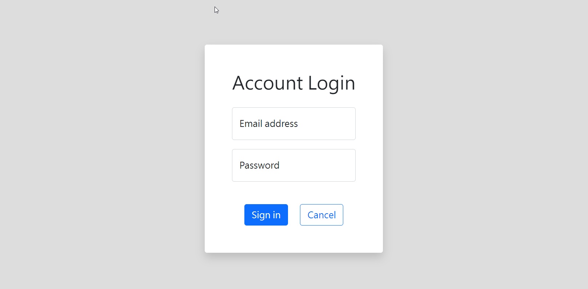
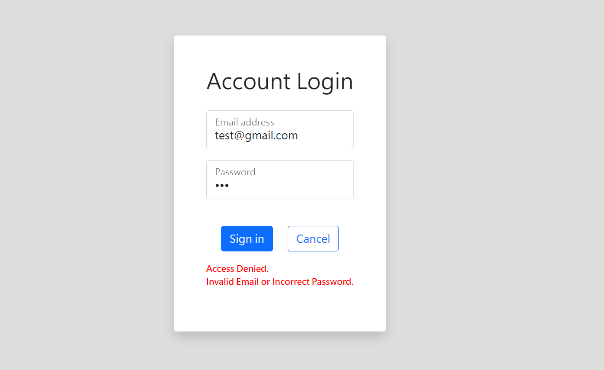
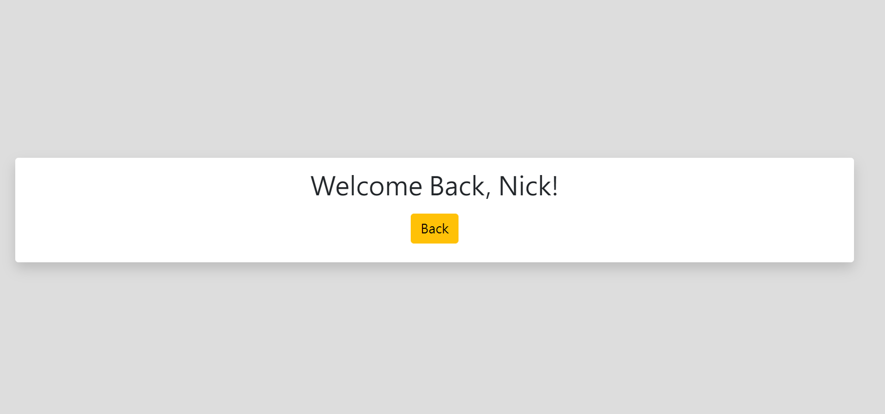

# Login Practice
使用Express做出簡易版登入功能

首頁

使用者帳號與密碼驗證

驗證失敗畫面

驗證成功畫面

## 功能詳情
+ 點選Sign in登入。
+ 點選Cancel清空表單。
+ 驗證使用者帳號與密碼。
  + 驗證成功顯示Welcome page。
  + 驗證錯誤顯示失敗提示。
  + test account
    Account: tony@stark.com
    Password: iamironman

## 安裝執行
1. 確認安裝node.js & npm。
2. 開啟Terminal將專案 clone 至本地位置： `git clone https://github.com/Gincoolwant/reurl.git`
3. 開啟Terminal並移至專案資料夾安裝使用套件： `npm install`
4. 請設定你的環境變數： `MongoDB_URI_LOGIN="Your MongoDB connection string"`
5. 執行專案： `npm run start`
6. 成功連線會看見訊息： 

   `App is connecting on http://localhost:3000`

   `MongoDB is connecting`
 
   請開啟瀏覽器輸入網址 http://localhost:3000 進入首頁。

## 開發環境與工具
+ [Visual Studio Code](https://visualstudio.microsoft.com/zh-hant/)
+ [Node.js@16.17.0](https://nodejs.org/en/)
+ [Express@4.18.2](https://www.npmjs.com/package/express)
+ [Express-Handlebars@6.0.6](https://www.npmjs.com/package/express-handlebars)
+ [Bootstrap@v5.2](https://getbootstrap.com/)
+ [Font-awesome@6.2.0](https://fontawesome.com/)
+ [Body-parser@1.20.1](https://www.npmjs.com/package/body-parser)
+ [Method-override@3.0.0](https://www.npmjs.com/package/method-override)
+ [MongoDB Cloud](https://www.mongodb.com/)
+ [Mongoose@6.6.5](https://mongoosejs.com/)

## 開發人員
[CK](https://github.com/Gincoolwant)